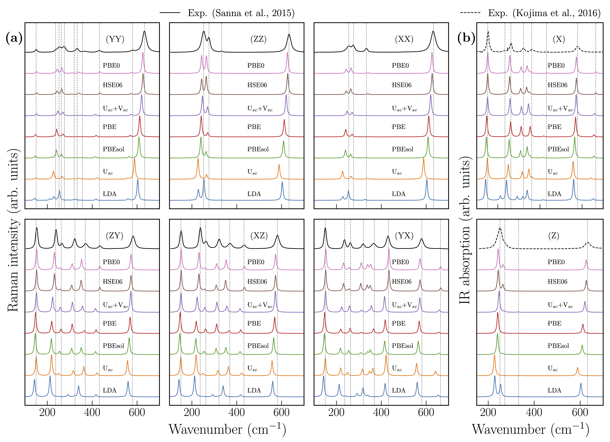
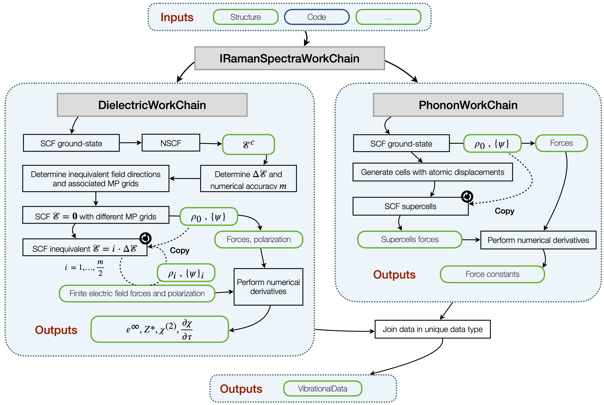
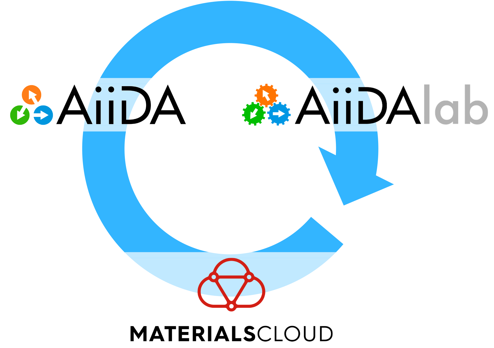

# What is AiiDA-Vibroscopy?

AiiDA-Vibroscopy is a collection of high-level workflows for the automated computation of *harmonic phonons* and *vibrational spectra* using **any functional** and pseudopotential formalism. It is based on top of the aiida-quantumespresso and aiida-phonopy plugins, relying respectively on the Quantum ESPRESSO and Phonopy codes.

All-functionals IR and Raman spectra
: Vibroscopy provides you with an highly optimized workflow for the computation of vibrational spectra, allowing for the use of any functional.
: {height=150px align=center}

Highly optimized, automated workflows
: The provided workflows are standardized to replace repetitive scripting, and are optimized to maximally minimize the walltime consumption.
: {height=150px align=center}

Data management
: All the information is efficiently stored in a unique data type, the `VibrationalData`, so that all the information are gathered together simplifying its access.

Reproducibility
: Thanks to AiiDA, it is possible to reproduce the results of a calculation, or to continue a workflow from a previous state.

Shareability
: As for any other AiiDA plguin, the workflows and data can be shared with others, by exporting them to a portable archive format.
: This can be used to share workflows with collaborators, or to publish workflows and data on to cloud archives such as [Materials Cloud](https://www.materialscloud.org/).
: {height=200px align=center}
