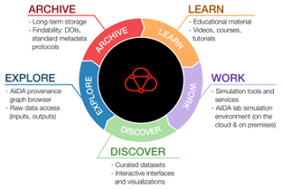

# Next steps

This tutorial has shown how to use AiiDA-Vibroscopy for running ab-initio phonons and vibrational spectra with the use of different functionals, using [Quantum ESPRESSO](https://www.quantum-espresso.org/) as quantum engine and [Phonopy](https://phonopy.github.io/phonopy/) for pre- and post-processing.

It has also shown how the results of these workflows can be explored and post-processed.

From here, we hope you will want to use AiiDA and AiiDA-Vibroscopy for your own research!

## Check out the Vibroscopy documentation

The aiida-vibroscopy documentation is available at [https://aiida-vibroscopy.readthedocs.io/en/latest/](https://aiida-vibroscopy.readthedocs.io/en/latest/), and contains a wealth of information on how to use Vibroscopy, and the theory behind it.

## Publishing your research

If you have used AiiDA and Vibroscopy in your research, you consider archiving your research on the [Materials Cloud Archive](https://archive.materialscloud.org/).
This is a free service provided by the [Materials Cloud](https://www.materialscloud.org/) project,
and allows you to publish your research in a citable and reproducible manner.

:::{subfigure} 2
:gap: 1em
:layout-sm: 1
{align=center}
{align=center}
:::
